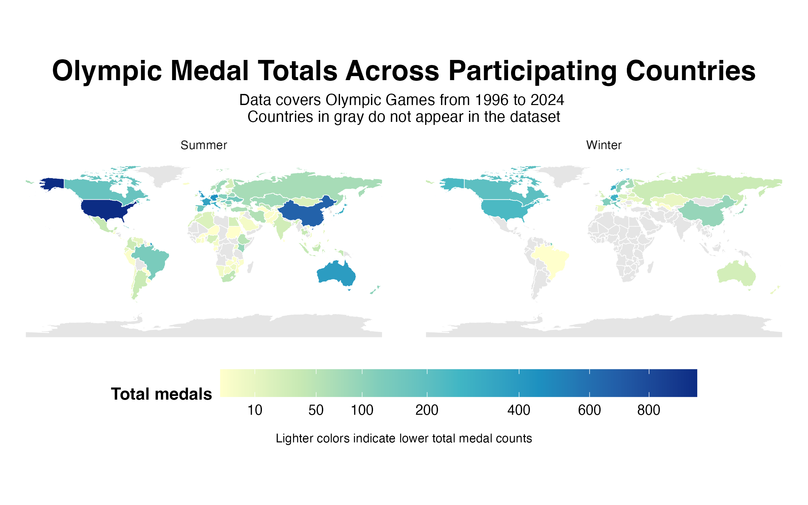
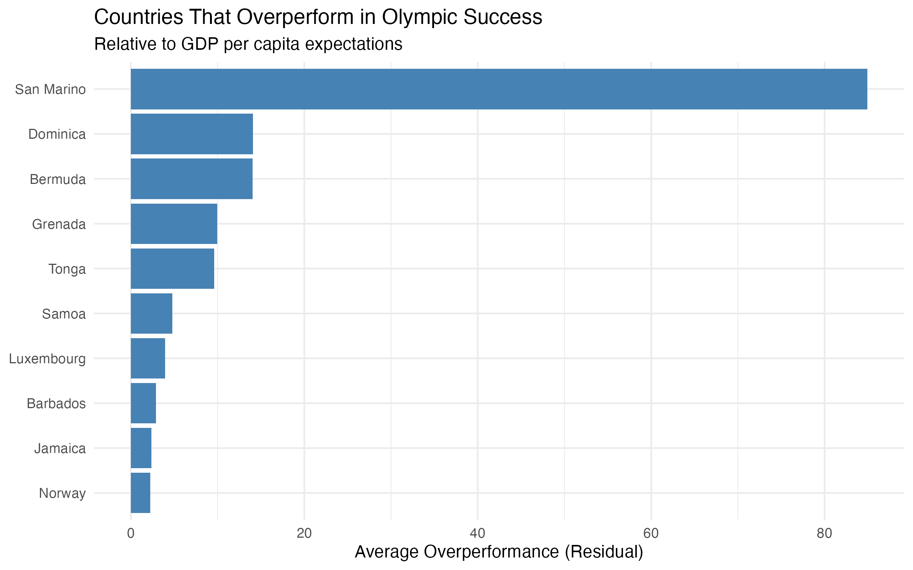
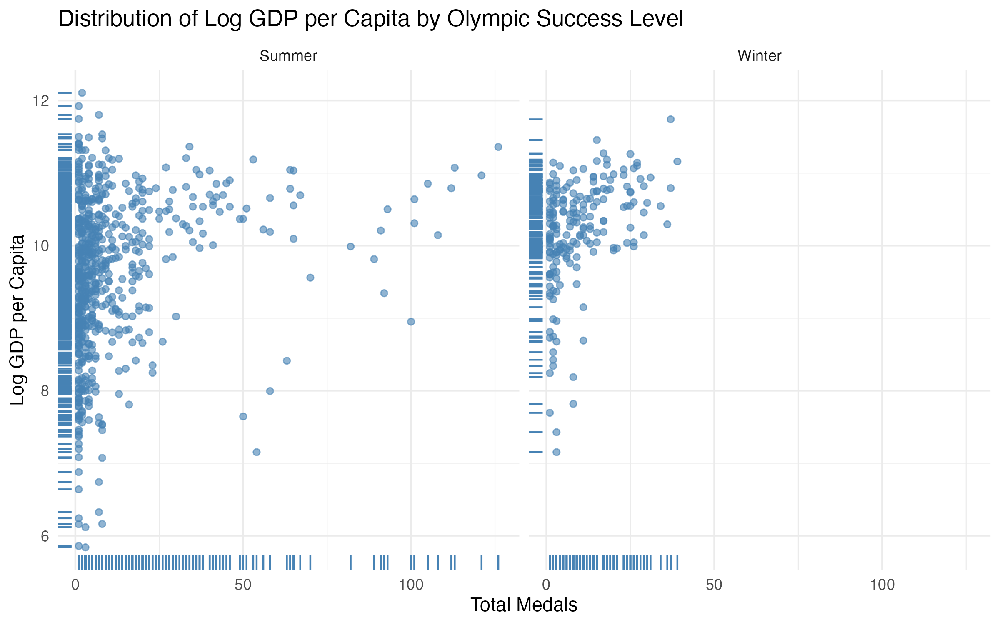
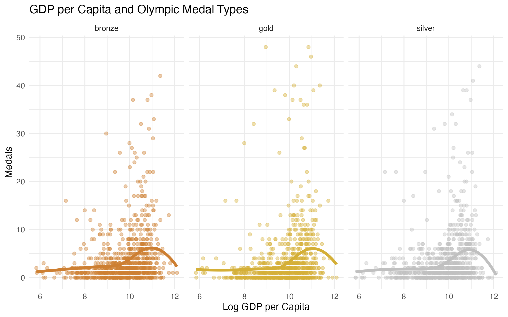
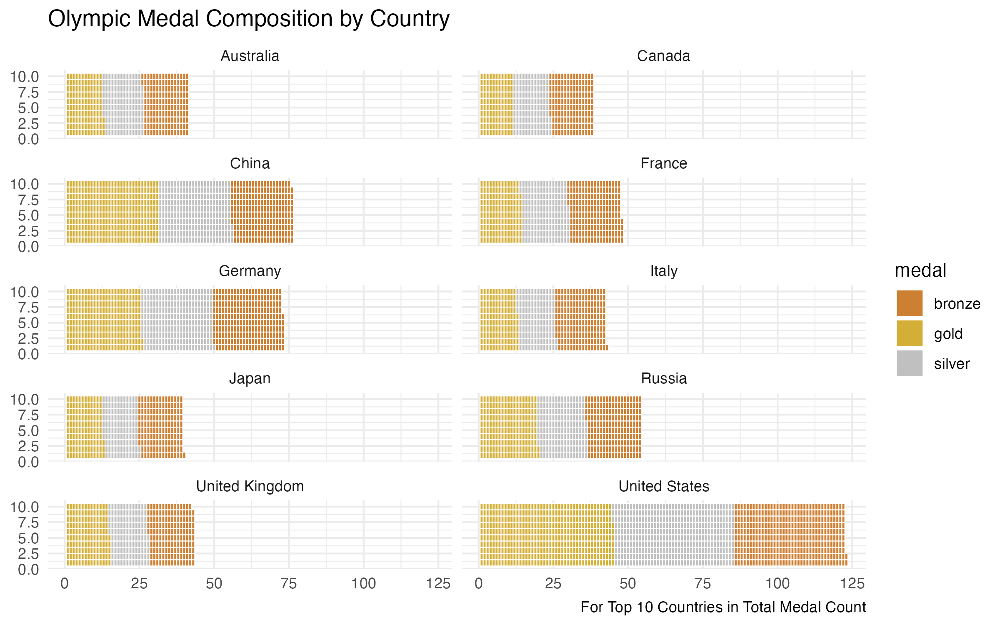

```{r setup, include=FALSE}
knitr::opts_chunk$set(echo = TRUE)
```

## Motivation

### How well Economic Indicators predict Olympic medal counts across countries in the Summer and Winter Olympics?*

We chose this topic because the 2026 Winter Olympics in Italy sparked our interest in understanding why some countries perform better than others in the Olympic Games. This led us to explore whether economic indicators can help predict how many medals a country wins in both the Summer and Winter Olympics.

We were especially interested in looking at whether broader measures of development, such as GDP, population, labor market conditions, and education-related indicators, are associated with Olympic success.

## Data Sources

### Olympic Medal Data and World Bank Indicators

Our project relies on two main data sources. The first is Olympic medal data from the Summer and Winter Games, which we web scraped from Wikipedia medal tables. The second is economic and demographic data from the World Bank Open Data platform, from which we collected a wide range of country-level indicators related to economic development.

The Olympic dataset provides information on medal counts by country, year, and season, while the World Bank dataset adds economic and social context for each country-year observation. Combining these two sources allowed us to study how national characteristics may relate to Olympic performance.

## Data Wrangling and Preparation
### Building the Main Dataset

After collecting the Olympic medal data from Wikipedia and the economic indicators from the World Bank API, we cleaned and combined both sources into one main dataset.

For the Olympic data, we scraped the Wikipedia category pages for both Summer and Winter Olympic medal tables, extracted the yearly page links, and looped through each page to identify the correct medal table. Since the medal table was not always located in the same position on each page, we identified it by checking for key columns such as rank, gold, silver, bronze, and total. We then cleaned country names, removed unnecessary rows such as totals and mixed teams, and added the corresponding year and season.

For the World Bank data, we downloaded multiple economic and demographic indicators by country and year, then combined them into one wide dataset. We then left-joined the World Bank data with the Olympic medal data by country and year so that each Olympic observation could be matched with the available country-level indicators.

### Exploring the Variables

Once the datasets were merged, we explored the raw variables to better understand their distributions. These initial plots showed that several variables, especially GDP and population, were strongly right-skewed. Because of this, we applied log transformations to improve the distributions and make the visualizations easier to interpret.

Medal-related variables, however, remained somewhat skewed even after transformation. This is expected, since many countries win very few medals while a small number of countries win many.

### Selecting the Most Complete Time Period

Because the World Bank data were incomplete for some countries and earlier years, we also conducted a completeness check by year. We measured the amount of non-missing data available across indicators and identified the period with the strongest overall coverage.

This step allowed us to focus the analysis on the years with the most complete information, creating a cleaner and more reliable dataset for visualization.


## Figures Developed

### Global Distribution of Olympic Medal Totals




This figure uses a choropleth map to show Olympic medal totals by country for the Summer and Winter Olympics. A map was chosen because the goal is to show geographic patterns in medal distribution across the world, and faceting by season allows an easy comparison between Summer and Winter Games. Color intensity represents total medals, with darker colors indicating higher totals. Because medal totals are highly skewed, a square-root transformation was applied to the color scale so that differences among countries with smaller medal totals are still visible. Gray countries are countries that do not appear in the medal dataset.

### Countries That Overperform Relative to Economic Expectations


### Relationship Between Economic Development and Olympic Success


### Economic Development and Medal Type Distribution


### Medal Composition of Top Olympic Countries



