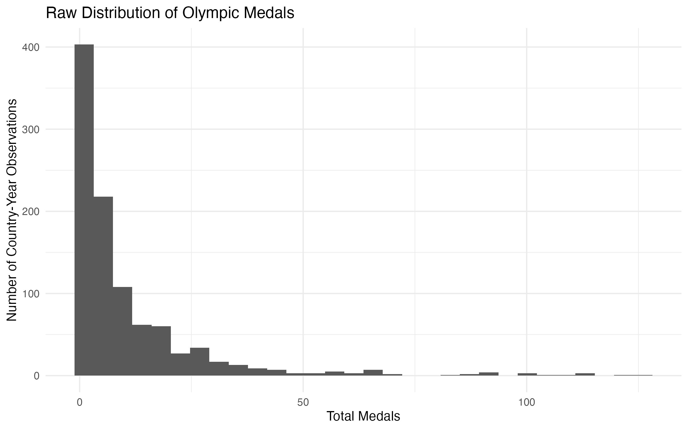
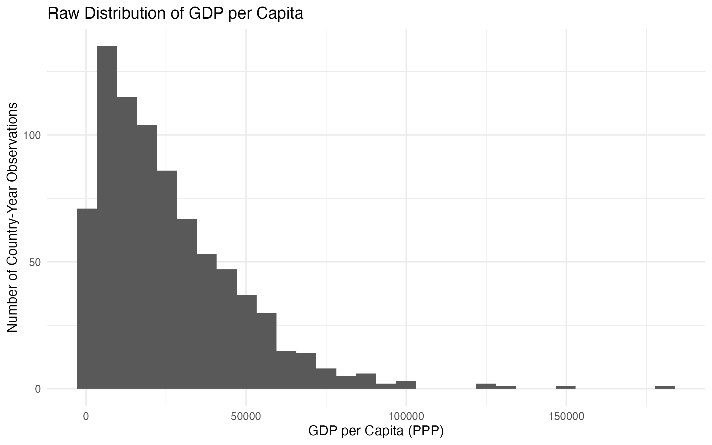

```{r setup, include=FALSE}
knitr::opts_chunk$set(echo = TRUE)
```

*Motivation*
*How well Economic Indicators predict Olympic medal counts across countries in the Summer and Winter Olympics?*

We were inspired to do this topic since the windter olympics 2026 took place in italy at the beggining of the year. We were curious to look into inconomic indicators predicting the number of medals that a country could win. 

*Data*

Our project mainly ralies in 2 datasets, one is the olympic medals data form the summer and winter games, this data we were able to webscraped it from wikipedia, the economic indicators we got them from the world bank open source data, were we were able to pull many diferent economic indicator for a country development. 

*Data Wrangeling*

Wikipedia: To collect the data from Wikipedia, we scraped the category pages for Summer and Winter Olympic medal tables and extracted the links for each year’s medal table page. Because the medal table was not always in the same position on every page, we looped through all tables on each page and identified the correct one using column names such as rank, gold, silver, bronze, and total. We then cleaned the extracted data and kept the country name, medal counts by type, total medals, year, and season. After repeating the same process for both the Summer and Winter Games, we combined the two datasets into one complete Olympic medal dataset.

World Bank: 


Main Data Set: once we organized and clean wikipedia data and the world bank data, we looked at plot of the raw data to see what shape the data had. after looking at the raw plots, you can find some exaples bellow, we decided that we should apply a log transformation since the data was very hight skeewed, by doing the log transformation we were able to have the data more centered for visualization it make the data better in some data points and in others the skeewness is so strong that the transformation didn't take away. see plots bellow for exploring plots after transformation.





